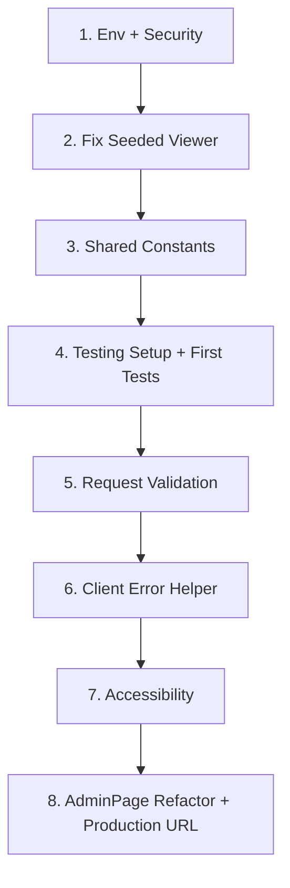

# NSL Rankings — Improvement Plan

## Current Status & Next Steps

### ✅ Completed (High Priority)

- **Environment & Security Hardening**: `.env.example`, JWT validation, Helmet, rate limiting
- **Code Organization**: Shared constants extraction, duplicates removed
- **Testing Foundation**: Comprehensive business logic tests (6 test suite covering scoring edge cases)
- **Infrastructure**: Vitest setup, test scripts, database testing patterns

### 🎯 Next Priority (Production-Critical Tests)

- **Auth Security Tests**: Login flows, JWT validation, role-based access
- **Upload Integration Tests**: CSV workflows using mock-data files
- **Rankings Integration Tests**: Full tournament → results → computed rankings

### 📋 Todo List Status

- Add .env.example and env validation (JWT_SECRET production check)
- Add Helmet and rate limiting to server (express-rate-limit on /api/auth/login)
- Fix seeded viewer account - add viewer/viewer123 user in server/db/database.js
- Extract shared constants - remove EVENTS/EVENT_LABELS duplicates
- Add testing setup - Vitest config, comprehensive business logic tests
- Add critical security tests - auth routes, JWT validation
- Add integration tests - CSV upload using mock-data files
- Add request validation - express-validator or Zod for all API routes
- Consistent error handling - add getErrorMessage() helper in client/src/utils/api.js
- Accessibility improvements - htmlFor labels, ARIA for tabs, focus management
- Production API URL - add VITE_API_URL env var support in client
- Refactor AdminPage - extract CompetitorManager, TournamentManager, etc.
- Improve upload error shape consistency - standardize ApiError format
- Mock data integration for tests
- Structured logging
- Health check endpoint
- Performance monitoring
- Competitor merge/deduplication UI
- Deployment setup - Supabase (Postgres), Railway/Render backend, Vercel frontend
- LLM-assisted CSV parsing - AI agent for messy spreadsheet extraction
- Handwriting recognition - OCR on scanned score sheets
- Agent layer - automate full import pipeline for admins

---

## Summary

The codebase is well-structured per PROJECT_SUMMARY, but has gaps in testing, security, validation, accessibility, and developer experience. This plan addresses them in priority order.

---

## 1. High Priority

### 1.1 Add Testing

**Current:** No unit, integration, or E2E tests.

**Plan:**

**✅ COMPLETED**: Vitest setup with comprehensive business logic tests

- ✅ `server/db/rankings.test.js` — 6 tests covering scoring logic (true average, null vs 0, /4 total, edge cases)
- ✅ Vitest config and test scripts for server

**NEXT PRIORITY** (Most Critical Tests for Production Confidence):

- `server/routes/auth.test.js` — login success/failure, JWT validation, role-based access
- `server/routes/upload.test.js` — CSV integration using mock-data/.csv files
- `server/db/rankings.integration.test.js` — full tournament → results → rankings workflow

**Files:** `client/vitest.config.js`, `client/package.json` (test script), new `*.test.js` files in `client/src` and `server/`.

---

### 1.2 Fix Known Issues (PROJECT_SUMMARY TODOs)

**Seeded viewer account**

- **File:** [server/db/database.js](server/db/database.js)
- **Change:** After admin seed (lines 63–67), add a second block: if no `user` role exists, seed `viewer` / `viewer123`.
- **Purpose:** Provide a default non-admin account for testing and demo.

**Competitor merge UI (Future)**

- **Status:** Deferred per PROJECT_SUMMARY (“future feature”). Not in immediate scope; document as backlog.

---

### 1.3 Add `.env.example` and Env Validation

**Current:** No `.env` or `.env.example`; JWT secret and client URL have hardcoded fallbacks.

**Plan:**

- Create `.env.example` at repo root with:
    - `PORT=3001`
    - `JWT_SECRET=change-me-in-production`
    - `CLIENT_URL=http://localhost:5173`
    - `NODE_ENV=development`
- Update [server/routes/auth.js](server/routes/auth.js) (or `middleware/auth.js`) to fail fast if `NODE_ENV=production` and `JWT_SECRET` is unset or equals `'dev-secret-change-in-production'`.
- Add `.env` to `.gitignore` if not already present.

---

### 1.4 Security Hardening

| Change            | Location             | Detail                                                                                             |
| ----------------- | -------------------- | -------------------------------------------------------------------------------------------------- |
| **Helmet**        | `server/index.js`    | Add `helmet()` for security headers (XSS, clickjacking, etc.).                                     |
| **Rate limiting** | `server/index.js`    | Add `express-rate-limit` on `/api/auth/login` (e.g., 5 req/min per IP) to reduce brute-force risk. |
| **JWT secret**    | `middleware/auth.js` | Enforce non-default secret in production (see 1.3).                                                |

**Files:** [server/index.js](server/index.js), [server/middleware/auth.js](server/middleware/auth.js), `package.json` (add `helmet`, `express-rate-limit`).

---

## 2. Medium Priority

### 2.1 Request Validation (Server)

**Current:** Manual checks only; no schema validation.

**Plan:**

- Add **express-validator** or **Zod** for route validation.
- Validate:
    - `POST /login`: `username` (string, 1–50 chars), `password` (non-empty).
    - `POST /users`: `username`, `password` (min length), `role` (enum).
    - `POST /upload/preview` and `/commit`: required body fields, `tournament_date`, `activeEvents`.
    - Rankings routes: `id` params as positive integers.
- Return 400 with structured `{ error, details? }` for validation failures.

**Files:** [server/routes/auth.js](server/routes/auth.js), [server/routes/upload.js](server/routes/upload.js), [server/routes/rankings.js](server/routes/rankings.js), new `server/validators/` or inline `body(...).isString()` etc.

---

### 2.2 Consistent Error Handling (Client)

**Current:** Inconsistent patterns: `err.response?.data?.error` vs `d?.errors?.join(' • ')` (UploadPage).

**Plan:**

- Add `getErrorMessage(err)` in [client/src/utils/api.js](client/src/utils/api.js):
    - If `err.response?.data?.error` → use it.
    - If `err.response?.data?.errors` (array) → join with `•`.
    - Else → generic “Something went wrong.”
- Replace ad-hoc `catch` blocks across pages with this helper.
- Optional: centralize error display in a small `ErrorBanner` component.

**Files:** [client/src/utils/api.js](client/src/utils/api.js), [client/src/pages/UploadPage.jsx](client/src/pages/UploadPage.jsx) (and other pages with try/catch).

---

### 2.3 Extract Shared Constants (EVENTS / EVENT_LABELS)

**Current:** `EVENTS` and `EVENT_LABELS` duplicated in AdminPage, UploadPage, CompetitorPage (client) and in upload.js (twice), csvParser.js, rankings.js (server).

**Plan:**

- **Client:** Create `client/src/constants/events.js`:

```js
    export const EVENTS = ['knockdowns', 'distance', 'speed', 'woods'];
    export const EVENT_LABELS = { knockdowns: 'Knockdowns', ... };


```

- **Server:** Create `server/constants/events.js` with same values; import in upload.js, csvParser.js, rankings.js.
- Remove duplicate definitions from [AdminPage.jsx](client/src/pages/AdminPage.jsx), [UploadPage.jsx](client/src/pages/UploadPage.jsx), [CompetitorPage.jsx](client/src/pages/CompetitorPage.jsx), [upload.js](server/routes/upload.js).

---

### 2.4 Accessibility Improvements

| Change           | Location                              | Detail                                                                                           |
| ---------------- | ------------------------------------- | ------------------------------------------------------------------------------------------------ |
| **Labels**       | AdminPage, LoginPage, UploadPage      | Add `htmlFor` on labels, link to `id` on inputs.                                                 |
| **Admin tabs**   | AdminPage.jsx (tab buttons)           | Add `role="tablist"`, `role="tab"`, `aria-selected`, `aria-controls`, keyboard nav (arrow keys). |
| **Placeholders** | AdminPage (add competitor, user form) | Add visible labels; don’t rely on placeholders alone.                                            |
| **Focus**        | Forms                                 | Ensure first focusable element gets focus where appropriate; preserve focus on error.            |

**Files:** [client/src/pages/AdminPage.jsx](client/src/pages/AdminPage.jsx), [client/src/pages/LoginPage.jsx](client/src/pages/LoginPage.jsx), [client/src/pages/UploadPage.jsx](client/src/pages/UploadPage.jsx).

---

## 3. Lower Priority

### 3.1 Production API URL

**Current:** Client uses `/api` (Vite proxy); production build has no config for backend URL.

**Plan:**

- Add `VITE_API_URL` to `.env.example` (default empty = use relative `/api` for same-origin).
- In [client/src/utils/api.js](client/src/utils/api.js): `baseURL: import.meta.env.VITE_API_URL || '/api'`.
- Document in README: set `VITE_API_URL=https://api.example.com` for production when frontend and backend are on different hosts.

---

### 3.2 Refactor AdminPage

**Current:** ~365 lines with 4 logical sections (Competitors, Tournaments, Manual Entry, Users).

**Plan:**

- Extract subcomponents: `CompetitorManager.jsx`, `TournamentManager.jsx`, `ManualEntryForm.jsx`, `UserManager.jsx`.
- Keep `AdminPage.jsx` as layout + tab state; import and render subcomponents.
- **Benefits:** Smaller files, easier testing, clearer ownership.

---

### 3.3 Improve Upload Error Shape Consistency

**Current:** Upload preview returns `{ errors, warnings, competitors }`; other APIs return `{ error: string }`.

**Plan:**

- Keep upload shape for its multi-message use case.
- Add a shared `ApiError` shape in server: `{ error: string, details?: string[] }` for validation/upload commit failures.
- Client `getErrorMessage` already handles both `error` and `errors`.

---

## 4. Implementation Order Suggestion



---

## 5. Out of Scope (Per PROJECT_SUMMARY)

- Competitor merge/deduplication UI
- Deployment (Supabase, Railway, Vercel)
- LLM-assisted CSV parsing, handwriting OCR, agent layer
